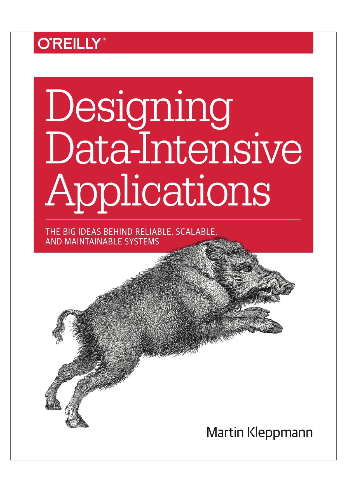
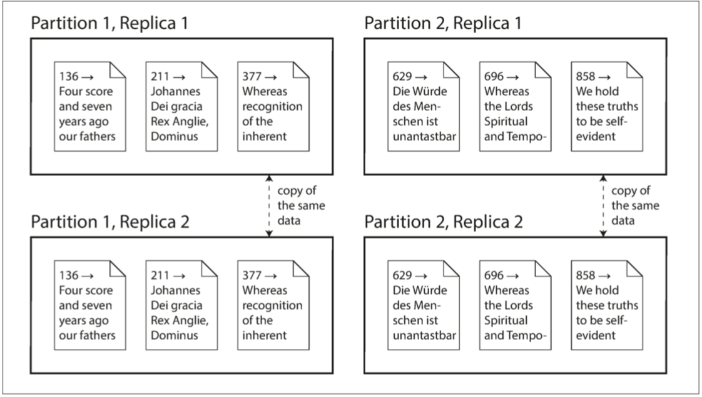

# 《设计数据密集应用》 

* 译者：冯若航 （fengruohang@outlook.com , Vonng）
* 作者： Martin Kleppmann
* 原书名称：《Designing Data-Intensive Application》




## 声明

纯粹出于学习目的与个人兴趣翻译，仅供交流与个人学习使用，严禁用于商业目的与公开传播发行。目前尚无中文译本，有能力阅读英文书籍者请购买原版支持。

```
《中华人民共和国著作权法》
第四节 权利的限制
第二十二条　在下列情况下使用作品，可以不经著作权人许可，不向其支付报酬，但应当指明作者姓名、作品名称，并且不得侵犯著作权人依照本法享有的其他权利：
(六)为学校课堂教学或者科学研究，翻译或者少量复制已经发表的作品，供教学或者科研人员使用，但不得出版发行;
```


## 序言

*计算是一种流行文化，流行文化鄙视历史。 流行文化关乎个体身份和参与感，与合作无关。它是活在当下的，也与过去和未来无关。 我认为大部分（为了钱）编写代码的人就是这样的， 他们不知道他们的文化来自哪里。*

——阿兰·凯接受Dobb博士杂志采访时（2012年）


## 目录

### 第一部分： 数据系统的基石

1. [可靠性、可扩展性、可维护性](ch1.md)  [初翻]
2. [数据模型与查询语言](ch2.md) [初翻]
3. [存储与检索](ch3.md) [初翻]
4. [编码与演化](ch4.md) [机翻+初翻50%]

### 第二部分： 分布式数据

5. [复制](ch5.md) [未翻译]
6. [分片](ch6.md) [未翻译]
7. [事务](ch7.md) [未翻译]
8. [分布式系统的麻烦](ch8.md) [未翻译]
9. [一致性与共识](ch9.md) [未翻译]

### 第三部分：衍生数据

10. 批处理 [未翻译]
11. 流处理 [未翻译]
12. 数据系统的未来 [未翻译]


## 第一部分： 数据系统的基石

前四章介绍了适用于所有数据系统的基本思想：无论在单台机器上运行的，还是分布在多台机器上的。

1. [第一章](ch1.md)介绍了将在本书中使用的术语和方法。**可靠性，可扩展性和可维护性** ，这些词汇到底意味着什么，以及如何去实现这些目标。
2. [第二章](ch2.md)比较了几种不同的**数据模型和查询语言** 。从程序员的角度来看，这是数据库之间最明显的区别。不同的数据模型适用于不同的应用场景。
3. [第三章](ch3.md)将深入**存储引擎**内部，并研究数据库如何在磁盘上摆放数据。不同的存储引擎针对不同的工作负载进行了优化，选择合适的存储引擎会对性能产生巨大的影响。
4. [第四章](ch4)比较了几种数据编码（**序列化**）的各种格式，特别讨论了在应用需求经常变化、模式需要随时间调整的环境中，这些格式的利弊。

第二部分将讨论分布式数据系统的特殊问题。


## 第二部分： 分布式的数据

*一个成功的技术，可行性的优先级必须高于PR，你可以糊弄别人，但糊弄不了自然规律。*

——罗杰斯委员会报告（1986）

在本书的第一部分中，我们讨论了数据存储在一台机器上数据系统的方方面面。现在到了第二部分中，我们提一个更高级的问题：如果**多台机器**参与数据的存储和检索会发生什么？
将数据库分布到多台机器上可能会有很多原因：

* 可扩展性

  如果您的数据量读取负载/写入负载比单台计算机可以处理的还要大，则可以将负载分散到多台计算机上。

* 容错/高可用性

  如果即使一台机器（或多台机器，网络或整个数据中心）出现故障，您的应用程序仍然需要继续工作，您可以使用多台机器来提供冗余。当一台故障时，另一台可以接管。

* 延迟

  如果在世界各地都有用户，也许你会考虑在全球多处部署服务器，既而每个用户从地理上相近的数据中心获取服务，以免用户需要等待网络数据包穿越半个世界。

### 扩展到更高的负载

如果只是需要扩展到支持更高的负载，最简单的方法就是购买更强大的机器（有时称为垂直扩展 vertical scaling或scaling up）。许多CPU、RAM芯片和磁盘可以在一个操作系统内相互连接，快速互连允许任何CPU访问存储器或磁盘的任何部分。在这种共享内存架构中，所有的组件都可以看作是一台单独的机器（在大型机中，尽管任何CPU都可以访问内存的任何部分，但是总有一些内存区域与一些CPU更接近。（称为非均匀内存访问 nonuniform memory access，或者NUMA）。 为了有效地利用这种架构特性，需要对处理进行细分，以便每个CPU主要访问临近的内存，这意味着底层仍然进行了分区，即使表面上看起来只有一台机器在运行）

共享内存方法的问题在于，开销的增长速度快于线性增长：一台机器的CPU数量翻倍，内存大小也翻倍，磁盘大小翻倍，但成本通常多的可不止一倍。而且由于瓶颈存在，一台双倍规格机器不一定能处理双倍的负载。

共享内存体系结构可以提供有限的容错能力，相比之下，使用高端机器虽然具有热插拔组件（可以不关机更换磁盘，内存模块，甚至CPU），但是它必然局限于单个地理位置。

另一种方法是**共享磁盘架构**，它使用多台具有独立CPU和RAM的机器，但将数据存储在机器之间共享的磁盘阵列上，这些磁盘通过快速网络连接（Network Attached Storage, Storage Area Network）。此架构用于某些数据仓储，但竞争和锁定的开销限制了共享磁盘方法的可扩展性[2]。

#### 无共享架构

相比之下，**无共享架构**（shared-nothing 有时称为水平扩展 horizontal scaling 或 scaling out）已经相当普及。在这种架构中，运行数据库软件的每台机器/虚拟机都称为节点（node）。每个节点只使用各自的CPU，内存和磁盘。节点之间的任何协调都是在软件层面使用传统网络实现的。

无共享系统不需要特殊的硬件，所以你可以用任何性价比最好的机器。也许可以跨多个地理区域分发数据从而减少用户延迟，也许可以在整个数据中心丢失的情况下幸免于难。随着云端虚拟机部署的出现，即使是小公司，现在无需Google级别的运维，也可以实现多地分布式架构。

在这一部分里，我们将重点放在无共享架构上，并不是因为它们一定是每个用例的最佳选择，而是因为它们要求应用程序开发人员最为谨慎。如果你的数据分布在多个节点上，你需要意识到这样一个分布式系统中约束和权衡 ——数据库并不能神奇地把这些东西藏起来。

虽然分布式无共享架构具有许多优点，但它通常也会给应用程序带来额外的复杂性，有时也会限制您可以使用的数据模型表现力。在某些情况下，一个简单的单线程程序可以比一个拥有100多个CPU核心的集群表现得更好[4]。另一方面，无共享系统可以非常强大。接下来的几章将详细讨论分布式数据的问题。

### 复制 vs 分区

数据分布在多个节点上有两种常见的方式：

* 复制(Replication)

  在几个不同的节点上保存相同数据的副本，可能位于不同的位置。 复制提供了冗余：如果某些节点不可用，则仍然可以从其余节点提供数据。 复制也可以帮助提高性能。

   [第五章](ch5.md)将讨论复制。

* 分区 (Partitioning)

  将大型数据库拆分成称为分区的较小子集，以便不同的分区可以指派:给不同的节点（也称为分片 sharding）。 

  [第六章](ch6.md)将讨论分区。

复制和分区是不同的机制，但它们经常同时使用。如图II-1所示。



##### 图II-1 复制与分区

理解了这些概念，就可以开始讨论在分布式系统中需要做出的困难抉择。

[第七章](ch7.md)将讨论**事务(Transaction)**，这对了解数据系统中可能出现的所有问题以及可以做些什么很有帮助。

[第八章](ch8.md)和[第九章](ch9.md)将讨论分布式系统的基本局限性

在本书的第三部分中，将讨论如何将多个（可能分布的）数据存储集成到一个更大的系统中，以满足复杂应用程序的需求。 但首先我们来谈谈分布式的数据。


## 第三部分：衍生数据

本书的第一部分和第二部分，自底向上把所有关于分布式数据库的主要考量都讲了一遍。从数据在磁盘上的布局，一直到故障时关于分布式系统一致性的局限性。但所有的讨论都假定了应用程序中只用了一种数据库。

现实世界中的数据系统往往更为复杂。大型应用程序经常需要以多种方式访问和处理数据，没有一个数据库可以同时满足所有这些不同的需求。因此应用程序通常组合使用多种组件：数据存储，索引，缓存，分析系统，等等，并实现在这些组件中移动数据的机制。

本书的最后一部分，会研究将多个不同数据系统（可能有着不同数据模型，并针对不同的访问模式进行优化）协调一致地集成入应用架构时会遇到的问题。软件供应商经常会忽略这一方面的系统建设，并声称他们的产品能够满足您的所有需求。在现实世界中，集成不同的系统是实际应用中最重要的事情之一。

### 记录和派生数据系统

从高层次上看，存储和处理数据的系统可以分为两大类：

#### 记录系统（System of record）

一个关于记录的系统，也被称为*真相源*（source of truth），保留了权威版本的数据。当新的数据进入时（例如，用户输入）首先会在这里记录。每个事实恰好只表示一次（表示通常是标准化的 normalized）。如果另一个系统和记录系统之间有任何差异，那么记录系统中的值是（根据定义）是正确的。

#### 衍生数据系统（Derived data systems）

衍生系统中的数据，通常来自另一个系统的现有数据，以某种方式进行转换或处理的结果。如果丢失衍生的数据，您可以从原始来源重新创建它。典型的例子是*缓存*：如果存在，数据可以从缓存中提供；如果缓存不包含所需数据，总是可以降级由底层数据库提供。非规范化的值，索引和物化视图也属于这个类别。在推荐系统中，预测汇总数据通常派生自来用户日志。

从技术上讲，派生数据是**冗余的(redundant)**，因为它重复了已有的信息。但是衍生数据对于获得良好的读性能通常是至关重要的。它通常是非规范化的。可以从同一个来源派生出多个不同的数据集，使得用户可以从不同的“视角”去洞察数据。

并不是所有的系统都在其架构中明确区分记录系统和派生系统，但是这是一种有用的区分方式，因为它明确了系统中的数据流：系统的哪一部分具有哪些输入和哪些输出，以及它们如何相互依赖。

大多数数据库，存储引擎和查询语言，本质上既不是记录系统也不是派生系统。数据库只是一个工具：如何使用它取决于你。记录系统和衍生数据系统之间的区别不在于工具，而在于应用程序中的使用方式。

通过梳理数据的派生关系，可以清楚地理解一个令人困惑的系统架构。这将贯穿本书的这一部分。

### 章节概述

[第十章](ch10.md)通过研究面向批处理的数据流系统，例如MapReduce，看看它们是如何给我们提供构建大规模数据系统的优秀工具和原理的。

[第十一章](ch11.md)将把这些概念应用到*流式数据*（data streams）中，使同样的任务能以更低的延迟完成。 

[第十二章](ch12.md)将对本书进行总结，探讨使用这些工具来构建可靠，可扩展和可维护的应用程序的思路。

